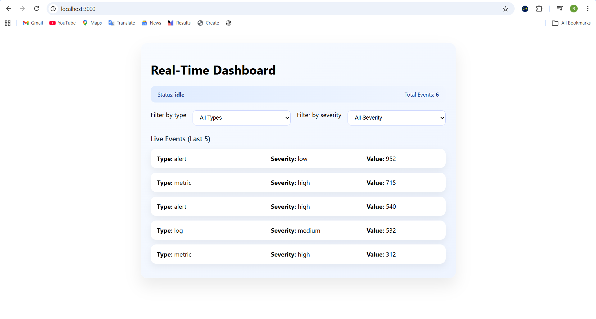

# Real-Time Interactive Dashboard Widget

##  Project Overview

This project is a **Real-Time Interactive Dashboard Widget** built using **React + Vite**, designed to consume live data from a **WebSocket-based mock API**, manage complex UI behavior using a **state machine (XState)**, and ensure reliability through **end-to-end testing (Cypress)**. The application is fully **Dockerized**, **accessible**, **responsive**, and optimized for **performance**.

The dashboard displays continuously updating events and allows users to **filter** data dynamically while maintaining predictable state transitions.

---

##  Tech Stack

* **Frontend:** React, Vite
* **State Management:** XState
* **Real-Time Communication:** WebSocket
* **Styling:** CSS Modules
* **Testing:** Cypress (E2E), Vitest (unit tests)
* **Containerization:** Docker, Docker Compose
* **Accessibility:** ARIA attributes, keyboard navigation

---

##  Features

*  Real-time event streaming via WebSocket
*  Explicit state management using XState
*  Dynamic filtering by **type** and **severity**
*  Debounced inputs for performance optimization
*  Keyboard-accessible UI with ARIA labels
*  Fully responsive (375px → 1920px)
*  5+ Cypress end-to-end tests
*  Dockerized frontend + mock API

---

##  Project Structure

```
realtime-dashboard/
├── src/
│   ├── components/
│   │   └── DashboardWidget/
│   │       ├── DashboardWidget.jsx
│   │       ├── DashboardWidget.module.css
│   │       ├── DashboardWidget.machine.js
│   │       └── DashboardWidget.test.js
│   ├── api/
│   │   └── realtimeService.js
│   ├── utils/
│   │   └── dataUtils.js
│   └── main.jsx
├── cypress/
│   └── e2e/
│       └── dashboard.cy.js
├── mock-server/
│   ├── server.js
│   ├── Dockerfile
│   └── package.json
├── docker-compose.yml
├── Dockerfile
├── .env
├── .env.example
├── README.md
└── vite.config.js
```

---

##  Environment Variables

### `.env.example`

```env
VITE_REALTIME_API_URL=ws://localhost:8080
```

### `.env`

```env
VITE_REALTIME_API_URL=ws://localhost:8080
```

> `.env` is used locally. `.env.example` documents required variables and is committed to Git.

---

##  Running the Project (Docker)

### Prerequisites

* Docker Desktop installed
* Ports **3000** and **8080** free

### Start Application

```bash
docker-compose up --build
```

* Frontend → [http://localhost:3000](http://localhost:3000)
* Mock WebSocket API → ws://localhost:8080

---

##  Running Tests

### Cypress (E2E Tests)

```bash
npx cypress open
```

Select:

* E2E Testing
* `dashboard.cy.js`

### Unit Tests

```bash
npm test
```

---

##  State Machine Architecture

The dashboard uses **XState** to explicitly manage UI behavior.

### States

* `idle`
* `loading`
* `error`

### Events

* `DATA_RECEIVED`
* `API_ERROR`

All real-time updates are funneled through the state machine, ensuring **predictable and testable behavior**.

---

##  Accessibility

* Semantic HTML
* ARIA labels on all interactive elements
* Keyboard navigable lists and dropdowns
* Screen-reader friendly live regions

✔ Passes accessibility checks with no critical issues

---

##  Performance Optimizations

* Debounced filter inputs (`lodash.debounce`)
* `useMemo` for filtered data
* Minimal re-renders during real-time updates

---

##  Screenshots

### Desktop View


### Mobile View


### Filtered Events


### Cypress Tests


---

##  Demo Video

> https://drive.google.com/file/d/1GGRGSxd_luk52uwcTdbaR1s47jDLUOiC/view

**Demonstrates:**
- Real-time dashboard updates
- Filtering by type and severity
- Responsive UI (mobile & desktop)
- Cypress end-to-end tests passing

---

## Conclusion

This project demonstrates **production-grade frontend engineering** with a focus on **predictability, testability, accessibility, and performance**. It reflects real-world patterns used in high-quality, real-time applications.
