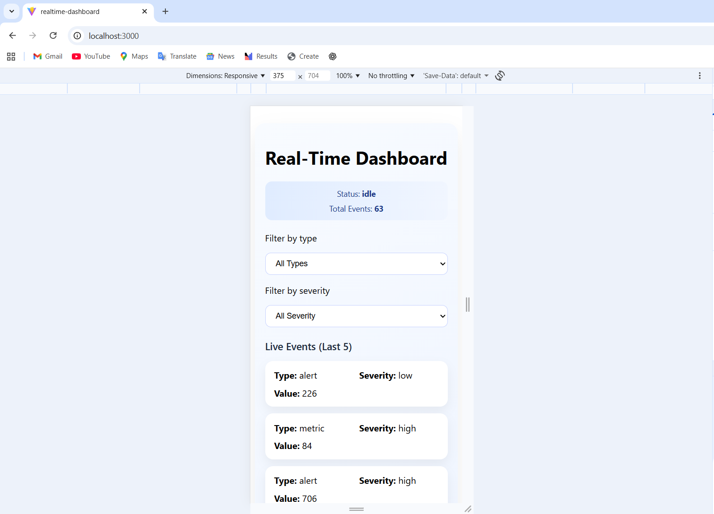
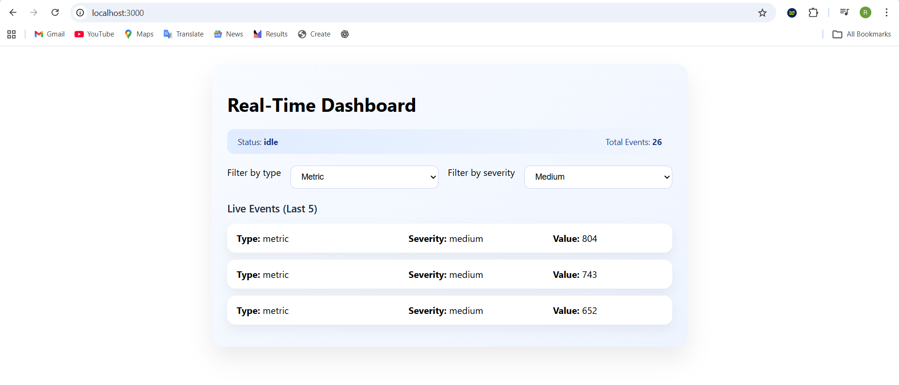
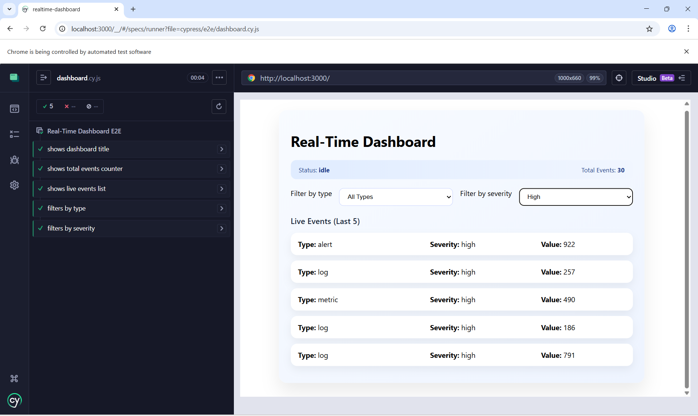

# Real-Time Interactive Dashboard Widget

## Project Overview

This project implements a **real-time dashboard** that receives live events from a WebSocket server and displays them dynamically. The dashboard allows users to filter and sort incoming data while maintaining predictable UI behavior using a **state machine (XState)**.

The application demonstrates real-time data handling, UI state management, Docker-based deployment, and automated testing.

---

## Key Features

* Real-time event streaming via **WebSocket**
* UI state management using **XState state machine**
* Dynamic filtering by:

  * Event type
  * Severity
* Sorting events by value (ascending / descending)
* Responsive and accessible UI
* Error handling for WebSocket failures
* Dockerized deployment using **Docker Compose**
* Unit testing with **Vitest**
* End-to-end testing with **Cypress**

---

## Tech Stack

* React
* XState
* WebSocket
* Docker
* Cypress
* Vitest
* CSS Modules

---

## Project Structure

```
realtime-dashboard
├── src
│   ├── api
│   │   └── realtimeService.js
│   ├── components
│   │   └── DashboardWidget
│   │       ├── DashboardWidget.jsx
│   │       ├── DashboardWidget.machine.js
│   │       ├── DashboardWidget.module.css
│   │       └── DashboardWidget.test.js
│
├── mock-server
│   └── server.js
│
├── cypress
│   └── e2e
│       └── dashboard.cy.js
│
├── Dockerfile
├── docker-compose.yml
├── .env.example
└── README.md
```

---

## Screenshots

### Mobile View


### Filtered Events


### Cypress Tests


---

##  Demo Video

A demo video showcasing the dashboard functionality is included in the repository.

Video Link: https://drive.google.com/file/d/1GGRGSxd_luk52uwcTdbaR1s47jDLUOiC/view

---

## Running the Project

### Option 1: Run with Docker 

```
docker-compose up --build
```

Then open the application in your browser:

```
http://localhost:3000
```

---

### Option 2: Run Locally

Install dependencies:

```
npm install
```

Start the frontend:

```
npm run dev
```

Start the mock server:

```
node mock-server/server.js
```

---

## Environment Variables

Create a `.env` file using the example below:

```
VITE_REALTIME_API_URL=ws://localhost:8080
```

When running with Docker, the variable is provided via `docker-compose.yml`.

---

## Running Tests

### Unit Tests (Vitest)

```
npm test
```

---

### End-to-End Tests (Cypress)

Start the application first, then run:

```
npx cypress open
```

Select:

```
dashboard.cy.js
```

---

## State Machine Logic

The dashboard uses **XState** to manage UI behavior:

States include:

* connecting
* idle
* error

Events handled by the machine:

* API_CONNECTED
* DATA_RECEIVED
* APPLY_FILTER
* SORT_DATA
* API_ERROR

This ensures predictable behavior for real-time updates and UI interactions.

---

## Accessibility

The dashboard includes accessibility improvements:

* Keyboard accessible controls
* ARIA labels for filters
* Semantic HTML structure

---

## Docker Setup

The project includes:

* Multi-stage Docker build for the frontend
* Docker container for the mock WebSocket API
* Docker Compose orchestration

Start both services using:

```
docker-compose up --build
```

---

## Conclusion

This project demonstrates **production-grade frontend engineering** with a focus on **predictability, testability, accessibility, and performance**. It reflects real-world patterns used in high-quality, real-time applications.
